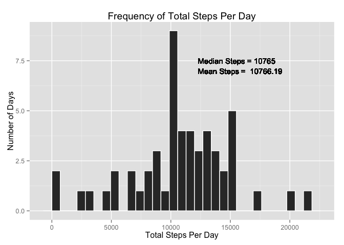
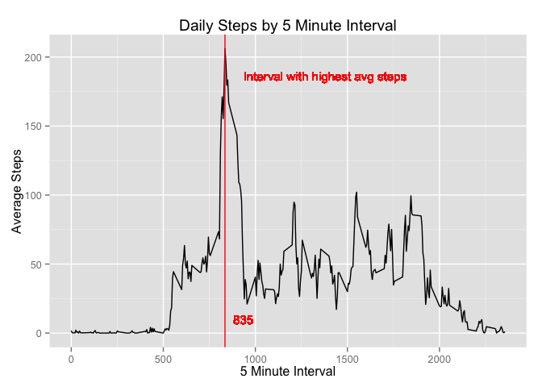
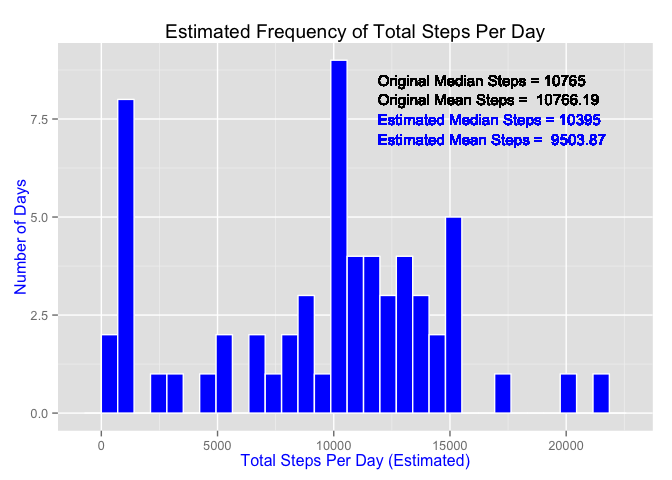
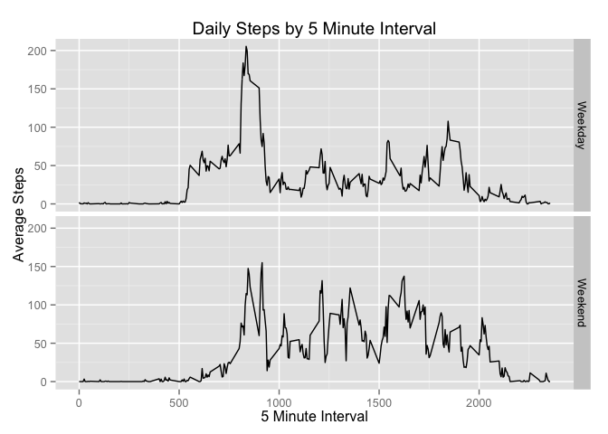

# PA1_template
Jeff Smith  
January 9, 2016  


### Load required libraries

```r
library("dplyr");

library("ggplot2")
```

### Read in activity.csv

```r
rawfile<-read.csv("activity.csv",  
                   header = TRUE,
                   colClasses = c(steps="integer"))
```

Create dataset without nulls

```r
activity<-rawfile[complete.cases(rawfile),] 
```


#  What is the mean total number of steps taken per day

Daily totals with NAs omitted

```r
actday<-summarize(group_by(activity, date), steps=sum(steps))
```


### Histogram of Total Number of Steps Taken Each Day

\

### Calcualte the Mean and Median Steps per day
 
The mean of the total number of steps is 10765.

```
## [1] "The mean of the total number of steps is: 10766.19"
```
*note: When using the inline code, it did not display the mean in the proper format.  It would display 1.076619\times 10^{4}.*


# What is the average daily activity pattern

### Calculate the average and median steps per interval

```r
actint<-summarize(group_by(activity, interval), avgsteps=mean(steps), medsteps=median(steps) );
maxstep<-filter(actint,avgsteps == max(actint$avgsteps))
```


### Create line plot average steps per interval
\

The 5-minute interval, on average, with the maximum number of steps: 835.


# Inputing missing values


The activity.csv file has **2304** rows with nulls in the steps column.

Replacing the nulls in the steps column with the **Median** steps for the 5 minute interval across all days.

### Replace missing values with Median

```r
nadata<- rawfile[(is.na(rawfile$steps)),];
fixed<-merge(x=select(nadata,interval,date) , y = select(actint,interval,steps=medsteps), by = "interval");
fixed$adjusted<-"Adjusted"
```
### Combining original clean data with fixed data

```r
compdata<-activity ;compdata$adjusted<-"Original";
compdata<-rbind(compdata,fixed)
```


### Create Daily totals with NAs fixed

```r
adjday<-summarize(group_by(compdata, date), steps=sum(steps))
```

## Histogram with Estimated Total Number of Steps Taken Each Day

\


# Are there differences in activity patterns between weekdays and weekends?


### Add weekday to compdata and distinguish weekday from weekend

```r
compdata$weekday<-weekdays(as.Date(compdata$date, format = "%Y-%m-%d"));
compdata$daytype<-("Weekday");
compdata[,6]<-with(compdata, replace(daytype,weekday %in% c("Saturday", "Sunday"), "Weekend"));
compdata$daytype<-as.factor(compdata$daytype)
```
### Summarizing complete data by daytype and interval

```r
wkint<-summarize(group_by(compdata, daytype, interval), avgsteps=mean(steps) )
```


### Create line plot average steps per interval
\
